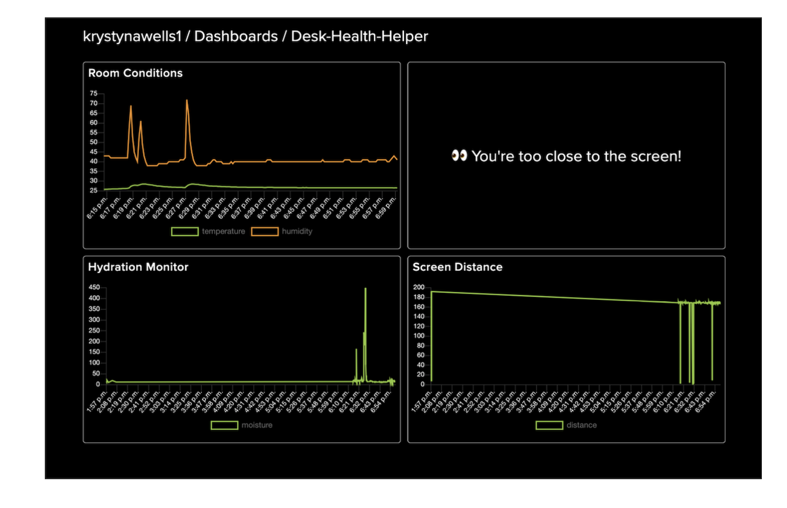
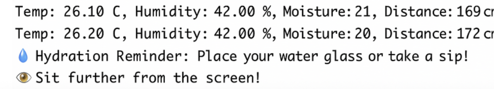

# IoT Desk Health Helper

This project is an IoT system designed to help maintain a healthy desk setup. It monitors air quality, hydration, and screen distance using a NodeMCU ESP8266 and simulated sensors.

## Features

- **Temperature & Humidity Monitoring:** Alerts if the environment is too hot, cold, or dry.  
- **Hydration Reminder:** Detects if a water glass is present and sends reminders to drink.  
- **Screen Distance Monitoring:** Alerts if you are sitting too close to your screen.  
- **Simulated Sensors:** Can run without hardware for testing purposes.  
- **Adafruit IO Integration:** Sends sensor readings to Adafruit IO dashboards.

## Screenshots

### Adafruit Dashboard


### Serial Monitor Output


## Installation

1. **Clone the repository**
   ```bash
   git clone https://github.com/YOUR_USERNAME/iot-desk-helper.git

2. **Install required libraries in Arduino IDE:**
  - DHT sensor library (Adafruit)
  - Adafruit MQTT library
  - NewPing

3. **Configure credentials:**
  - Set your Wi-Fi and Adafruit IO credentials in the code.

4. **Upload the code:**
  - Upload to a NodeMCU ESP8266.
  - (Optional) Enable simulation mode if no hardware is available.

## Usage
  - Run the code in Arduino IDE.
  - View simulated or real sensor data in the Serial Monitor.
  - Check your Adafruit IO dashboard for live sensor readings and alerts.

## Notes

- Simulation mode allows testing without physical sensors.
- Thresholds for temperature, humidity, distance, and moisture detection can be customized.
